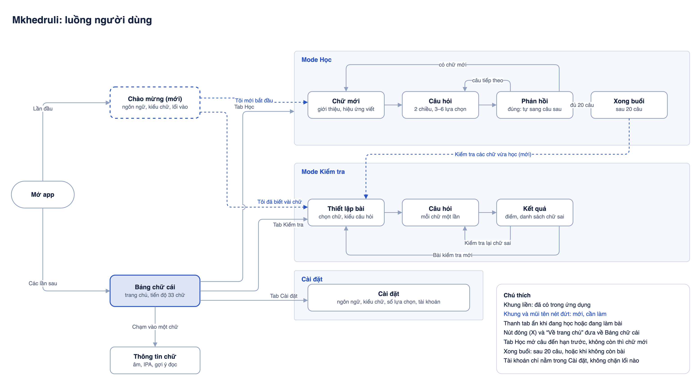

# Luồng người dùng

Tài liệu này chốt cách người học đi qua ứng dụng: lần đầu mở app thấy gì, từ đó sang đâu, và những lần sau quay lại ra sao. Mọi màn hình và lối đi trong tài liệu này đều đã có trong ứng dụng.

## Sơ đồ tổng quan



Nguồn sơ đồ: [user-flow.drawio](user-flow.drawio), mở bằng draw.io để chỉnh sửa. Sau khi sửa, xuất lại ảnh bằng lệnh:

```sh
drawio -x -f png -s 2 -b 24 -o docs/user-flow.png docs/user-flow.drawio
```

## Nguyên tắc điều hướng

- **Thanh tab dưới đáy** gồm bốn mục: Bảng chữ cái, Học, Kiểm tra, Cài đặt. Tab Học hiển thị huy hiệu đỏ ghi số thẻ đến hạn ôn.
- **Tab Học mở thẳng vào bài**: trước hết là câu hỏi của các thẻ đến hạn ôn; khi không còn thẻ đến hạn, ứng dụng giới thiệu chữ mới. Tab Kiểm tra luôn mở màn Thiết lập.
- **Thanh tab ẩn khi đang học hoặc đang làm bài**, để người học tập trung. Nút đóng (X) ở góc trên đưa về màn trước đó: từ mode Học về Bảng chữ cái, từ bài kiểm tra về màn thiết lập.
- **Tài khoản không chặn bất kỳ lối đi nào.** Toàn bộ tính năng dùng được khi chưa đăng nhập; tài khoản chỉ để đồng bộ tiến độ giữa các thiết bị và chỉ nằm trong Cài đặt.
- **Mode Kiểm tra không ảnh hưởng tới lịch ôn** của mode Học.

## Lần đầu mở app

### Màn Chào mừng

Hiện một lần duy nhất (đường dẫn `/welcome`), sau đó ứng dụng ghi nhận là đã xem và không hiện lại. Người học đã có tiến độ trên thiết bị, kể cả tiến độ đồng bộ từ tài khoản, không thấy màn này.

| Thành phần | Nội dung |
|---|---|
| Tiêu đề | Chữ ა lớn trên khung bốn dòng kẻ, tên ứng dụng ანბანი (Anbani), một dòng giới thiệu: học đọc 33 chữ cái tiếng Georgia, miễn phí, không cần tài khoản |
| Ngôn ngữ | Tiếng Việt / English, chọn sẵn theo ngôn ngữ của thiết bị |
| Kiểu chữ | Năm ô mẫu cùng hiển thị chữ ქარ: Đơn giản, Chữ in sách, Nét bút, Tròn đậm, Font của máy. Câu hướng dẫn: chọn kiểu giống với sách hoặc tài liệu bạn đang dùng |
| Lối vào chính | **Tôi mới bắt đầu** → mode Học, màn Chữ mới |
| Lối vào phụ | **Tôi đã biết vài chữ, kiểm tra trước** → mode Kiểm tra, phạm vi Tất cả (33) |

Người học đổi lại ngôn ngữ và kiểu chữ bất cứ lúc nào trong Cài đặt.

## Mode Học

| Màn | Người học thấy | Đi tiếp |
|---|---|---|
| Chữ mới | Chữ mới trên khung dòng kẻ (hiệu ứng viết chữ), âm, IPA, gợi ý đọc | **Đã nhớ, làm bài** → Câu hỏi |
| Câu hỏi | Nhìn chữ chọn âm, hoặc nhìn âm chọn chữ; 3–6 lựa chọn theo Cài đặt; phím 1–6 trên máy tính | Chọn đáp án → Phản hồi |
| Phản hồi | Đúng: ô chuyển xanh, tự sang câu sau. Sai: ô rung, hiện chữ đã chọn cạnh đáp án đúng kèm gợi ý | **Tiếp tục** → câu tiếp theo hoặc chữ mới |
| Xong buổi | Hiện trong hai trường hợp. Sau 20 câu: tiêu đề “Xong buổi học” và số câu đúng. Khi không còn bài để học: tiêu đề “Bạn đã ôn hết các thẻ đến hạn” và thời điểm ôn tiếp theo | **Kiểm tra các chữ vừa học**; **Học thêm** (chỉ khi vẫn còn bài); **Về trang chủ** |

Lịch ôn: mỗi chữ có hai thẻ riêng cho hai chiều hỏi. Ứng dụng chỉ giới thiệu chữ mới khi không có thẻ nào đến hạn và dưới bốn chữ đang ở giai đoạn làm quen; nếu vẫn chưa có gì để giới thiệu, ứng dụng hỏi tiếp các thẻ sắp đến hạn trong 15 phút tới.

## Mode Kiểm tra

| Màn | Người học thấy | Đi tiếp |
|---|---|---|
| Thiết lập | Chọn chữ: Tất cả (33), Đã học (n), Tự chọn trên bảng chữ cái. Kiểu câu hỏi: Nhìn chữ chọn âm, Nhìn âm chọn chữ, Trộn cả hai. Số lựa chọn theo Cài đặt | **Bắt đầu kiểm tra (n câu)** |
| Câu hỏi | Mỗi chữ hỏi đúng một lần, thứ tự ngẫu nhiên; bộ đếm câu; phản hồi đúng/sai ngay | Hết câu → Kết quả |
| Kết quả | Điểm, tỉ lệ đúng, danh sách chữ sai kèm âm đúng và chữ đã chọn | **Kiểm tra lại các chữ sai**, **Bài kiểm tra mới** |

Khi mở từ nút **Kiểm tra các chữ vừa học**, màn Thiết lập chọn sẵn phạm vi Đã học.

## Các lần sau

| Màn | Người học thấy | Đi tiếp |
|---|---|---|
| Bảng chữ cái | 33 chữ trên trang vở bốn dòng kẻ; màu cho biết chưa học, đang học, đã thuộc; âm hiện dưới các chữ đã học; tóm tắt tiến độ; lời mời cài ứng dụng khi trình duyệt cho phép | Chạm vào chữ → Thông tin chữ; thanh tab |
| Thông tin chữ | Bảng trượt lên: chữ lớn, âm, IPA, gợi ý đọc | **Đóng** → Bảng chữ cái |
| Cài đặt | Ngôn ngữ; kiểu chữ; số lựa chọn mỗi câu; tài khoản (không bắt buộc) | Thanh tab |

## Cài ứng dụng

Ứng dụng chạy được như một app cài trên máy (PWA). Thẻ mời cài nằm cuối màn Bảng chữ cái và chỉ hiện khi cài được:

- **Chrome, Edge, trình duyệt Android:** thẻ có nút **Cài ứng dụng**, mở đúng hộp thoại cài đặt của trình duyệt.
- **iPhone và iPad:** Safari không cho gọi hộp thoại, nên thẻ hướng dẫn bấm nút Chia sẻ rồi chọn Thêm vào màn hình chính.
- Thẻ tự ẩn khi ứng dụng đã được cài, và khi người học bấm **Để sau** thì không hiện lại trên thiết bị đó.

## Kiểu chữ Georgian

Người mới học thường bỡ ngỡ khi chữ trong ứng dụng khác với chữ trong sách, nên ứng dụng cho chọn năm kiểu chữ có phong cách khác hẳn nhau:

| Lựa chọn | Font | Đặc điểm |
|---|---|---|
| **Đơn giản** (mặc định) | Noto Sans Georgian | Nét đều, không chân; gần với cách Wikipedia và phần lớn điện thoại hiển thị |
| **Chữ in sách** | BPG Serif Modern | Có chân, nét thanh đậm; gần với chữ in trong sách |
| **Nét bút** | BPG Mikhail Stephan | Nét bút mềm, gần với chữ viết tay |
| **Tròn đậm** | BPG Glaho | Nét đậm, đầu nét tròn; dễ nhìn trên màn hình nhỏ |
| **Font của máy** | Font Georgian mặc định của thiết bị | Hiển thị đúng như thiết bị của người học; khung dòng kẻ được ẩn vì mỗi thiết bị có số đo chữ khác nhau |

Bốn font đầu được đóng gói sẵn trong ứng dụng nên dùng được khi không có mạng. Các font được đưa về cùng chiều cao chữ thường để không kiểu nào trông to hoặc nhỏ hơn hẳn, và khung bốn dòng kẻ được căn theo số đo riêng của từng font. Lựa chọn được lưu trên thiết bị, và lưu vào hồ sơ khi người học đã đăng nhập.

Bảng so sánh 23 font Georgian có giấy phép tự do dùng để chọn bộ năm kiểu này: [georgian-fonts.png](georgian-fonts.png). Giấy phép từng font nằm trong `static/fonts/LICENSE.md`.
