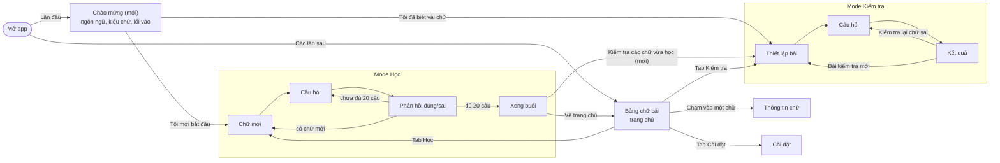

# Luồng người dùng

Tài liệu này chốt cách người học đi qua ứng dụng: lần đầu mở app thấy gì, từ đó sang đâu, và những lần sau quay lại ra sao. Ký hiệu **(mới)** đánh dấu phần chưa có trong ứng dụng hiện tại.

## Sơ đồ tổng quan

## Nguyên tắc điều hướng

- **Thanh tab dưới đáy** gồm bốn mục: Bảng chữ cái, Học, Kiểm tra, Cài đặt. Tab Học hiển thị huy hiệu đỏ ghi số thẻ đến hạn ôn.
- **Thanh tab ẩn khi đang học hoặc đang làm bài**, để người học tập trung. Nút đóng (X) ở góc trên đưa về màn trước đó: từ mode Học về Bảng chữ cái, từ bài kiểm tra về màn thiết lập.
- **Tài khoản không chặn bất kỳ lối đi nào.** Toàn bộ tính năng dùng được khi chưa đăng nhập; tài khoản chỉ để đồng bộ tiến độ giữa các thiết bị và chỉ nằm trong Cài đặt.
- **Mode Kiểm tra không ảnh hưởng tới lịch ôn** của mode Học.

## Lần đầu mở app

### Màn Chào mừng (mới)

Hiện một lần duy nhất, sau đó ứng dụng ghi nhận là đã xem và không hiện lại.

| Thành phần | Nội dung |
|---|---|
| Tiêu đề | Chữ ა lớn trên khung bốn dòng kẻ, tên მხედრული, một dòng giới thiệu: học đọc 33 chữ cái tiếng Georgia, miễn phí, không cần tài khoản |
| Ngôn ngữ | Tiếng Việt / English, chọn sẵn theo ngôn ngữ của thiết bị |
| Kiểu chữ | Ba ô mẫu cùng hiển thị các chữ ა ბ გ დ: Đơn giản, Có chân, Font của máy. Câu hướng dẫn: chọn kiểu giống với sách hoặc tài liệu bạn đang dùng |
| Lối vào chính | **Tôi mới bắt đầu** → mode Học, màn Chữ mới |
| Lối vào phụ | **Tôi đã biết vài chữ, kiểm tra trước** → mode Kiểm tra, phạm vi Tất cả (33) |

Người học đổi lại ngôn ngữ và kiểu chữ bất cứ lúc nào trong Cài đặt.

## Mode Học

| Màn | Người học thấy | Đi tiếp |
|---|---|---|
| Chữ mới | Chữ mới trên khung dòng kẻ (hiệu ứng viết chữ), âm, IPA, gợi ý đọc | **Đã nhớ, làm bài** → Câu hỏi |
| Câu hỏi | Nhìn chữ chọn âm, hoặc nhìn âm chọn chữ; 3–6 lựa chọn theo Cài đặt; phím 1–6 trên máy tính | Chọn đáp án → Phản hồi |
| Phản hồi | Đúng: ô chuyển xanh, tự sang câu sau. Sai: ô rung, hiện chữ đã chọn cạnh đáp án đúng kèm gợi ý | **Tiếp tục** → câu tiếp theo hoặc chữ mới |
| Xong buổi | Sau 20 câu: số câu đúng; nếu hết thẻ đến hạn: thời điểm ôn tiếp theo | **Kiểm tra các chữ vừa học (mới)**, **Học thêm**, **Về trang chủ** |

Lịch ôn: mỗi chữ có hai thẻ riêng cho hai chiều hỏi; ứng dụng giới thiệu chữ mới khi dưới bốn chữ đang ở giai đoạn làm quen.

## Mode Kiểm tra

| Màn | Người học thấy | Đi tiếp |
|---|---|---|
| Thiết lập | Chọn chữ: Tất cả (33), Đã học (n), Tự chọn trên bảng chữ cái. Kiểu câu hỏi: Nhìn chữ chọn âm, Nhìn âm chọn chữ, Trộn cả hai. Số lựa chọn theo Cài đặt | **Bắt đầu kiểm tra (n câu)** |
| Câu hỏi | Mỗi chữ hỏi đúng một lần, thứ tự ngẫu nhiên; bộ đếm câu; phản hồi đúng/sai ngay | Hết câu → Kết quả |
| Kết quả | Điểm, tỉ lệ đúng, danh sách chữ sai kèm âm đúng và chữ đã chọn | **Kiểm tra lại các chữ sai**, **Bài kiểm tra mới** |

Khi mở từ nút **Kiểm tra các chữ vừa học**, màn Thiết lập chọn sẵn phạm vi Đã học.

## Các lần sau

| Màn | Người học thấy | Đi tiếp |
|---|---|---|
| Bảng chữ cái | 33 chữ trên trang vở bốn dòng kẻ; màu cho biết chưa học, đang học, đã thuộc; âm hiện dưới các chữ đã học; tóm tắt tiến độ | Chạm vào chữ → Thông tin chữ; thanh tab |
| Thông tin chữ | Bảng trượt lên: chữ lớn, âm, IPA, gợi ý đọc | **Đóng** → Bảng chữ cái |
| Cài đặt | Ngôn ngữ; **Kiểu chữ (mới)**; số lựa chọn mỗi câu; tài khoản (không bắt buộc) | Thanh tab |

## Kiểu chữ Georgian

Người mới học thường bỡ ngỡ khi chữ trong ứng dụng khác với chữ trong sách, nên ứng dụng cho chọn kiểu chữ:

| Lựa chọn | Font | Đặc điểm |
|---|---|---|
| **Đơn giản** (mặc định) | Noto Sans Georgian | Nét đều, không chân; gần với cách Wikipedia và phần lớn điện thoại hiển thị |
| **Có chân** | Noto Serif Georgian | Nét thanh đậm, có chân; gần với chữ in trong sách |
| **Font của máy** | Font Georgian mặc định của thiết bị | Hiển thị đúng như thiết bị của người học; khung dòng kẻ được ẩn vì mỗi thiết bị có số đo chữ khác nhau |

Hai font Noto được đóng gói sẵn trong ứng dụng nên dùng được khi không có mạng. Lựa chọn được lưu trên thiết bị, và lưu vào hồ sơ khi người học đã đăng nhập.

## Hạng mục cần làm

1. Màn Chào mừng cho lần đầu mở app, gồm ngôn ngữ, kiểu chữ và hai lối vào.
2. Nút **Kiểm tra các chữ vừa học** ở cuối buổi học, mở Thiết lập với phạm vi Đã học.
3. Lựa chọn kiểu chữ trong Cài đặt và màn Chào mừng; đổi font mặc định sang Noto Sans Georgian.
